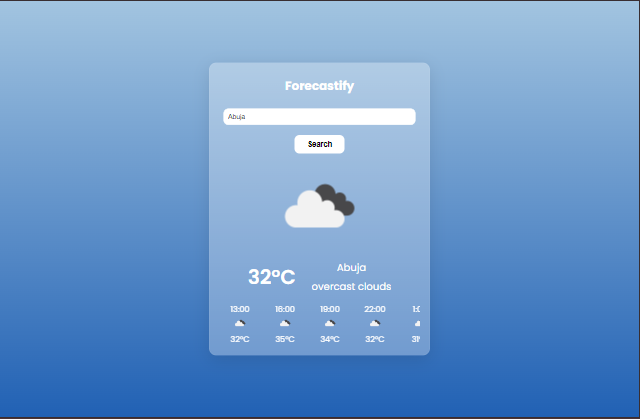

# Forecastify Weather App

This is a weather web application that displays real-time weather data and forecasts for the next 24 hours.

## Table of contents

-   [Overview](#overview)
    -   [The challenge](#the-challenge)
    -   [Screenshot](#screenshot)
    -   [Links](#links)
-   [My process](#my-process)
    -   [Built with](#built-with)
    -   [What I learned](#what-i-learned)
    -   [Continued development](#continued-development)
-   [Author](#author)


## Overview

### The challenge

Users should be able to:

-   Search and view weather information by city.
-   See forecast of the searched location for the next 24 hours
-   View the optimal layout of the application on every screen size
-   Have dynamic data that depends on the location rendered on app.

### Screenshot



### Links

-   GitHub URL: [Forecastify repository](https://github.com/stephikebudu/forecastify)
-   Live Site URL: [forecastify.app](https://stephikebudu-forecastify.vercel.app/)

## My process

### Built with

-   Responsive Design
-   Vanilla JavaScript
-   OpenWeatherMap API

### What I learned

I strengthened my knowledge on integrating external API into project as well as styling dynamic elements on the DOM. See code snippet below:

```js
const currentWeatherUrl = `https://api.openweathermap.org/data/2.5/weather?q=${city}&appid=${apiKey}`;
const forecastUrl = `https://api.openweathermap.org/data/2.5/forecast?q=${city}&appid=${apiKey}`;
```

### Continued development

I will continue to work on more complex projects that require external API integration to further solidify my knowledge.

## Author

-   GitHub - [@stephikebudu](https://github.com/stephikebudu)
-   Twitter - [@stephikebudu](https://www.twitter.com/stephikebudu)